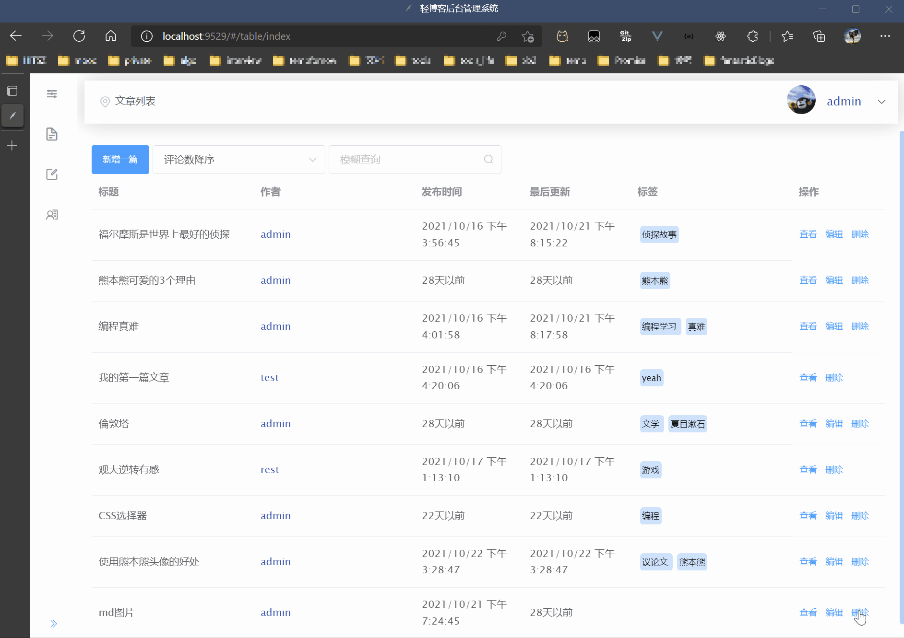
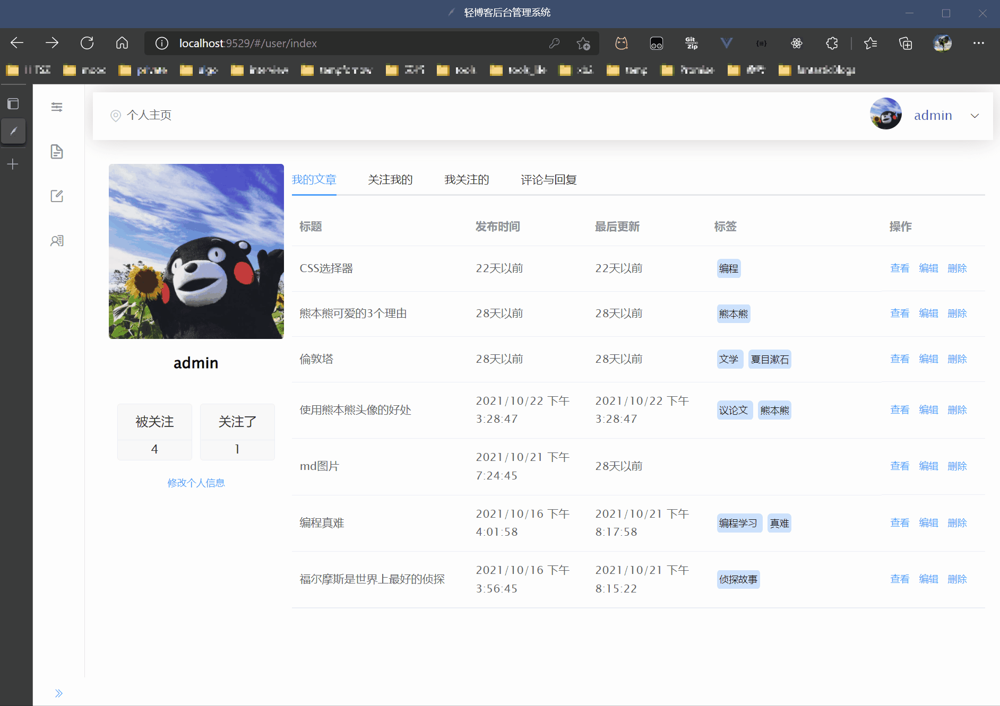

# README

<p>
  <a href="https://github.com/vuejs/vue">
    
  </a>
  <a href="https://github.com/ElemeFE/element">
    
  </a>
  <a href="https://expressjs.com/">
    
  </a>
  <a href="https://www.mysql.com/">
    
  </a>
</p>


## 概览

Article Admin 是一个前后端分离的文章/博客管理系统。前端采用Vue2.x结合ElementUI，后端使用Node.js的Express框架，数据库为MySQL8.0。包括用户注册登录、文章管理、个人中心、关注、收藏、站内信等多个模块、多种功能。

本项目是HITSZ数据库实验四的作品 & 学习Vue / MySQL的练习。

**[相关博客](https://woodenstone.github.io/Projects/article-admin/)**

## 快速开始

#### 克隆项目

```sh
git clone https://github.com/WoodenStone/article_admin.git
```

#### 数据库

将[articleAdmin.sql](https://github.com/WoodenStone/article_admin/blob/main/articleAdmin.sql)导入MySQL即可生成数据库。

>  注意，由于存在同一张表上存在多个触发器的情况，MySQL版本不能低于5.7。

#### 后端

```sh
cd article_admin/node_back_end

# 安装依赖
npm install
```

参考 `config.example.js` 新建 `config.development.js`，修改数据库名、用户名、密码。

启动项目：

```sh
node app.js
```

注意：需要修改数据库用户名、密码。

#### 前端

```sh
cd article_admin/vue_front_end

# 安装依赖
npm install

# 启动项目
npm run dev
```

访问 http://localhost:9529 查看前端界面。

## 主要功能

```sh
- 注册
- 登录 / 注销

- 用户信息 / 头像更改

- 文章管理
	- 发布文章
	- 删除文章
	- 编辑文章
	- 模糊搜索
	- 点赞
	- 收藏到特定收藏夹
	- Markdown编辑器及图片插入
	- 下载文章Markdown文件
	- 文章标签
	- 按特定方式排序（时间倒序、赞数降序、评论数降序、收藏数降序）

- 评论回复
	- 评论文章
	- 回复用户
	- 查看个人收到的评论、回复
	
- 收藏夹
	- 添加 / 删除收藏夹
	- 更改收藏夹名及描述
	- 内部文章查看、删除、移动

- 用户关注
	- 关注和取关

- 站内信
	- 收 / 发站内信
	- 阅读状态标记
	
- 输入错误地址时重定向至404
```

## 预览



